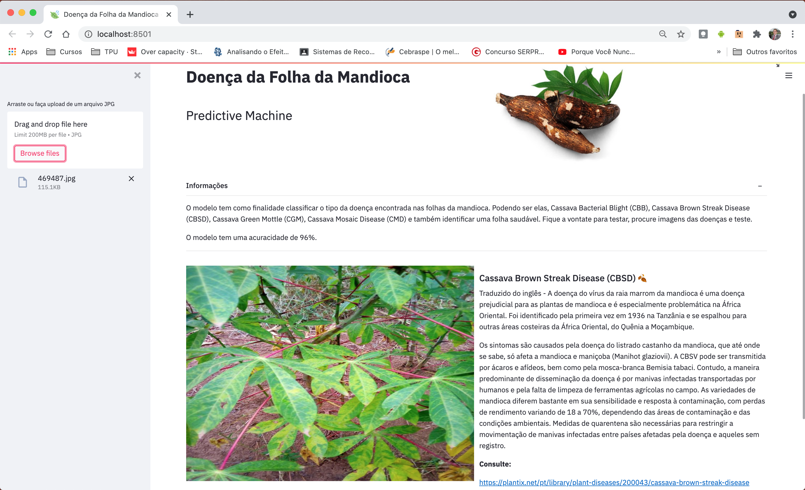

# App Cassava Leaf Disease - (Doença da Folha da Mandioca)

O Aplicativo consiste em uma solução de Machine Learning, na criação de uma maquina preditiva, um classificador. Usando Deep Learning, uma CNN (Convolutional Neural network), Transfer Learning entre outra técnicas de apredizado supervisionado. Usando o GitHub e [**Streamlit**](https://streamlit.io/) para o deploy. A Solução consistem em identificar doenças que afetam a mandioca, usando imagem da folha da mandioca.

A inspiração para criação veio da competição [**CassavaLeafDisease**](https://www.kaggle.com/c/cassava-leaf-disease-classification) do **kaggle** e para elaboração do trabalho de conclusão de especialização em Ciência de Dados e Analytics da UPE - Universidade de Pernambuco.

### Resultados
>A Solução tem uma acuracidade de 96%. Testes Realizados com um set de validação, imagens essas nunca vistas antes pelo modelo.

## Testando Aplicação

1. Procure na internet imagens de folhas da mandioca, essas imagens precisam ser das doenças nos quais o algoritimo foi treinado para identificar, são elas: **Cassava Bacterial Blight (CBB)**, **Cassava Brown Streak Disease (CBSD)**, **Cassava Green Mottle (CGM)** e **Cassava Mosaic Disease (CMD)**.

    

1. Faça o upload da imagem, e verifique o resultado!
